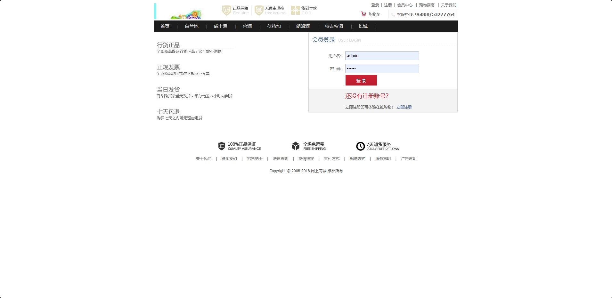
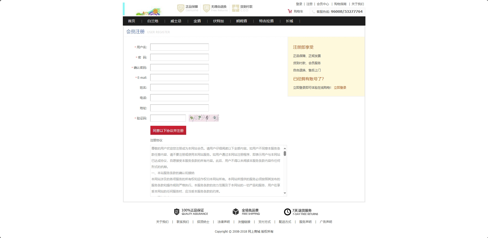
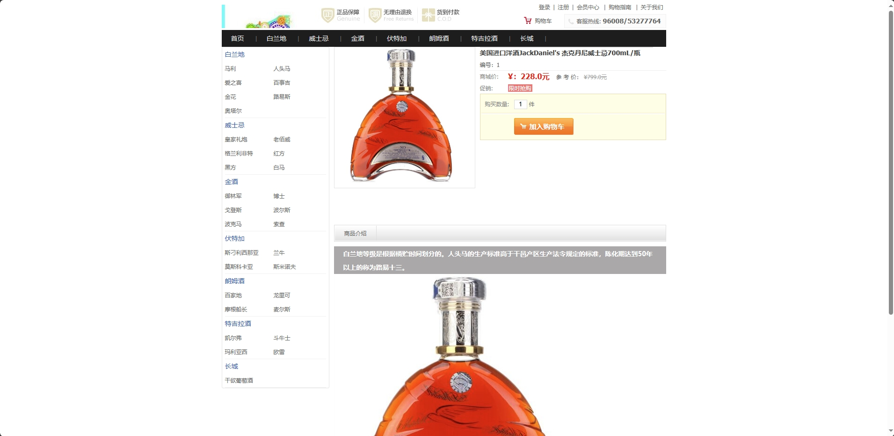
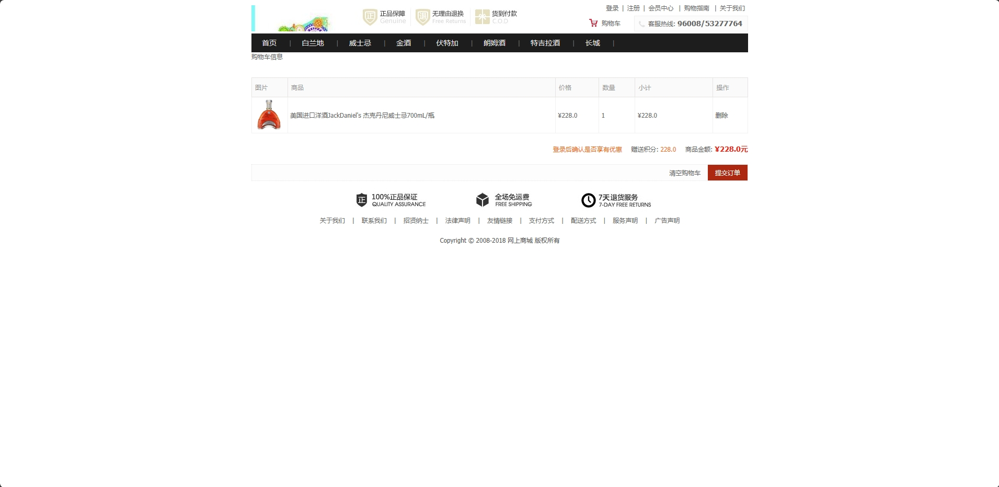
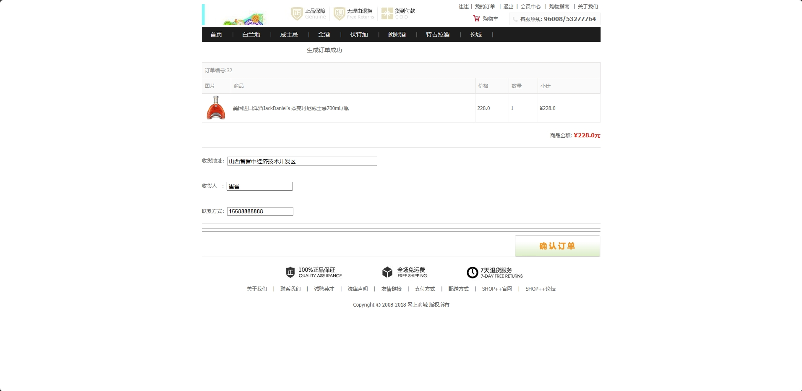

<h1 align="center">基于SSH框架的洋酒销售商城系统</h1>

<h4> 完整代码获取地址：从戎源码网（https://armycodes.com/） </h4>
<h4> 作者微信：19941326836 QQ：605739993 QQ群：655392706 </h4>
<h4> 承接计算机毕设、Java毕业设计、Python毕业设计、深度学习、机器学习 </h4>
<h4> 选题+开题报告+任务书+程序定制+安装调试+论文+答辩ppt 一条龙服务 </h4>
<h4> 毕业设计所有选题地址：(https://github.com/Descartes007/allProject) </h4>

## 一、项目介绍

基于SSH框架的洋酒销售商城系统：前端 JSP、BootStrap、JQuery、Ajax，后端 maven、struts、spring、hibernate；角色分为管理员和用户。管理员发布商品、添加一级和二级分类、发货、查看订单列表等；用户按商品类别购买、支付、添加购物车等。主要功能如下：

### 1、管理员：

- 基本操作：登录
- 用户管理：获取用户信息列表、编辑用户信息、删除用户
- 一级分类管理：获取一级分类列表、编辑一级分类信息、删除一级分类信息、新增一级分类
- 二级分类管理：获取二级分类列表、编辑二级分类信息、删除二级分类信息、新增二级分类
- 商品管理：获取商品信息列表、编辑商品信息、删除商品信息、新增商品信息、设置热门
- 订单管理：获取订单信息列表、查看订单详情、删除订单、发货

### 2、用户：

- 基本操作：登录、注册、修改密码、获取个人信息、修改个人信息
- 商品模块：获取商品信息列表、查看商品详情、加入购物车、提交订单、获取最新商品、获取最热商品、筛选商品
- 分类模块：获取一级分类列表、获取二级分类列表、筛选商品
- 我的订单：获取订单列表、查看订单详情、支付

## 二、环境

- <b>IntelliJ IDEA 2020.3</b>

- <b>Mysql 5.7.26</b>

- <b>Tomcat 9.0.41</b>

- <b>JDK 1.8</b>

## 三、运行截图

